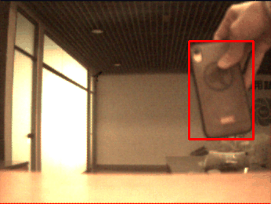
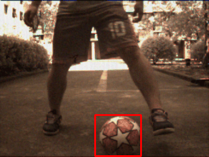
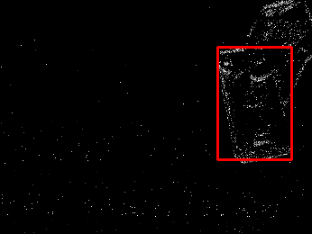
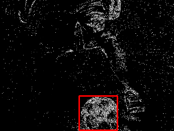
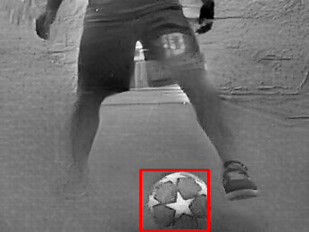

# EventSOT: A Novel Event-based Neuromorphic Vision Benchmark             for Single Object Tracking

> A subset (16 sequences) of EventSOT. 

---

## Table of Contents
- [Raw data](#raw-data)
- [Event representation](#event-representation)
- [Annotation](#annotation)
- [License](#license)

---

## Raw-data

We use  a [DAVIS346]( https://inivation.com/dvs/-product-variants/) which can out put both event stream and intensity (APS) frames to capture raw data from real-world.

### 1) Event data

The user can clik [here](https://drive.google.com/file/d/1HSPiEhg8GsLDemrhVlGG7v2gt7hKXKB3/view?usp=sharing) to dawnload raw event data. In the below, we show some examples of the event stream in the spatial-temporal space ( the events of object are marked in red).

  
  
Phone1 event stream

  
  
Phone1 event stream

### 2) Intensity (APS) frames

The user can clik [here](https://drive.google.com/file/d/1yLrvivO3M0jGa2jeztbXyz4gpt5-vshX/view?usp=sharing) to dawnload raw APS frames data. Here are some examples of APS frames.

  

  

    
      
    
Phone1 and Ball1 APS sequences.

  

  
---

## Event-representation
As event streams are fundamentally different with natural images, existing SOT trackers cannot be directly applied to them. Thus, we choose two popular event representation methods , **Surface of Active Events (SAE)** and **Natural Image Reconstruction (NIR)**.

### 1)  Active Events (SAE) 
We provide the code of SAE encode method `sae.py` and Adaptive SAE method `sae_ad.py`. 
If you want use the encoding code,you can enter the following command:  
  `python sae.py /path/to/aedat/file`       
  `python sae_ad.py /path/to/aedat/file`  
The user can clik [here](https://drive.google.com/file/d/1h0L_RpEfP1tIZbUpGoSAbb2Fv1Ezrauo/view?usp=sharing) to dawnload  SAE encoded frames data. Here are some examples of  SAE encoded frames.  

  
    
  
Phone1 and Ball1 SAE encoded frames.

### 2)  Natural Image Reconstruction (NIR)
For NIR method,  please clik [here](https://github.com/uzh-rpg/rpg_e2vid) .The user can clik [here](https://drive.google.com/file/d/1wWiyPdt32_jL1bcmtFm9Vb2hY0hk7fTG/view?usp=sharing) to dawnload NIR encoded frames data. Here are some examples of  NIR encoded frames.

  
    
  
Phone1 and Ball1 NIR encoded sequences.

---
## Annotation
For each sequence in EventSOT,  we provide **bounding box annotation**, **absent label** and **attributes labels**. 
The format of a bounding box is as `[x, y, width, height]`.  
The frames in which the tracking targets are out-of-view, fully occluded or under stop-go scenes are labeld with absent label ( When object is absent, set 1. Conversely, when object is visible, set 0).  
Each event sequence in EventSOT is labeled with eight attributes, including occlusion (OCC), scale variation (SV), rotate (ROT), camera motion (CM), stop go (SG), fast motion (FM), high dynamic range (HDR) and background clutter (BC).  
-   The bounding box annotation for each event sequence is contained in the event frame  folder (named groundtruth.txt) , or can clik [here](https://drive.google.com/file/d/1GSOdQE1kFU-d-3TpJZhWsCBr2i8iO5xe/view?usp=sharing) to dawnload bounding box annotation.
-   The user can clik [here](https://drive.google.com/file/d/1O0YLFhxWopdeLgtupMq9_t-z_ICnYck-/view?usp=sharing) to dawnload absent label.
-   The user can clik [here](https://drive.google.com/file/d/1jzqibzwguVQPYkl-djHnQTH4qjuuRFjl/view?usp=sharing) to dawnload attributes label.  

---

## License

This subeset of EventSOT is released under the Apache 2.0 license. See **[LICENSE](./LICENSE)**
